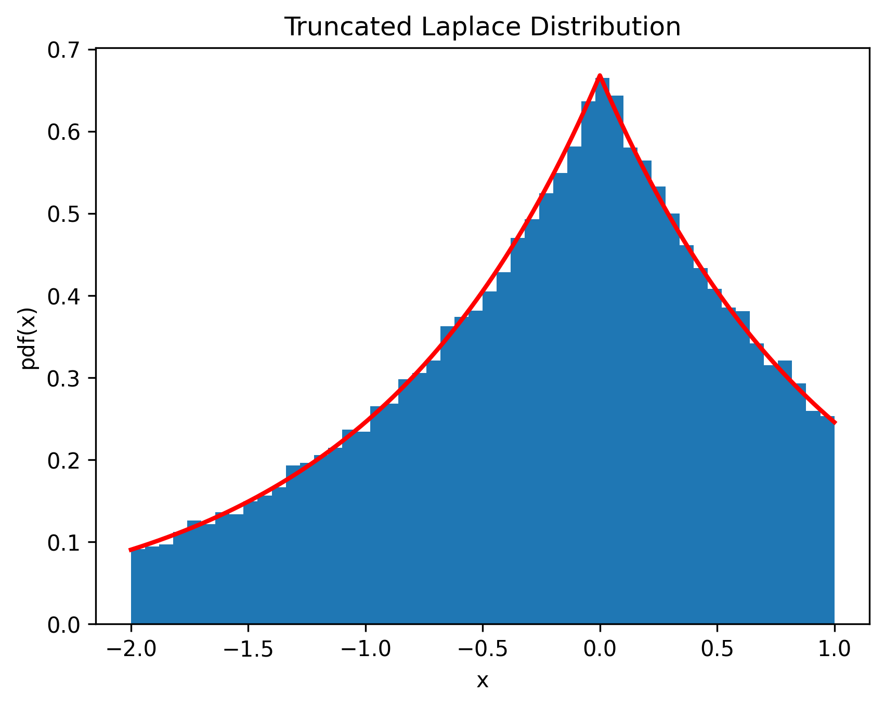

# Private Distributed Resource Allocation Without Constraint Violations

A privacy-preserving distributed optimization library for resource allocation problems with **provable constraint satisfaction guarantees**.

## Installation

### Method 1: Install directly from GitHub (Recommended)
```bash
pip install git+https://github.com/rui-huang-opt/pdra.git
```

### Method 2: Clone repository and install
```bash
git clone https://github.com/rui-huang-opt/pdra.git
cd pdra
pip install .
```

## Testing

To run the test suite and visualization examples, install the optional dependencies:
```bash
pip install .[test]
```

The following tests are included:

- **Distributed Quadratic Programming:**  
    Demonstrates the distributed optimization algorithm on a quadratic programming problem, verifying correctness and efficiency.  
    Run with:
    ```bash
    python test/distributed_qp.py
    ```
    The test suite includes experiments comparing three algorithms for distributed resource allocation: the proposed algorithm, RSDD [1], and dual decomposition [2].

- **Truncated Laplace Noise Test:**  
    Checks the implementation of the truncated Laplace noise mechanism, ensuring privacy-preserving properties are correctly applied.  
    Run with:
    ```bash
    python test/truncated_laplace.py
    ```
    Visualizes the effect of the truncated Laplace noise mechanism.  
    

## References

[1] [Notarnicola, I., & Notarstefano, G. (2019). Constraint-coupled distributed optimization: A relaxation and duality approach. *IEEE Transactions on Control of Network Systems*, 7(1), 483-492.](https://ieeexplore.ieee.org/abstract/document/8746216)

[2] [Simonetto, A., & Jamali-Rad, H. (2016). Primal recovery from consensus-based dual decomposition for distributed convex optimization. Journal of Optimization Theory and Applications, 168, 172-197.](https://link.springer.com/article/10.1007/s10957-015-0758-0)